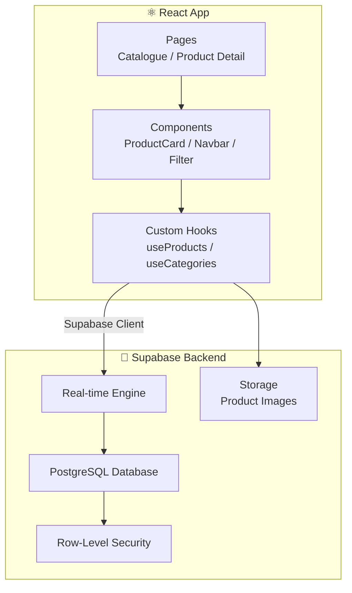
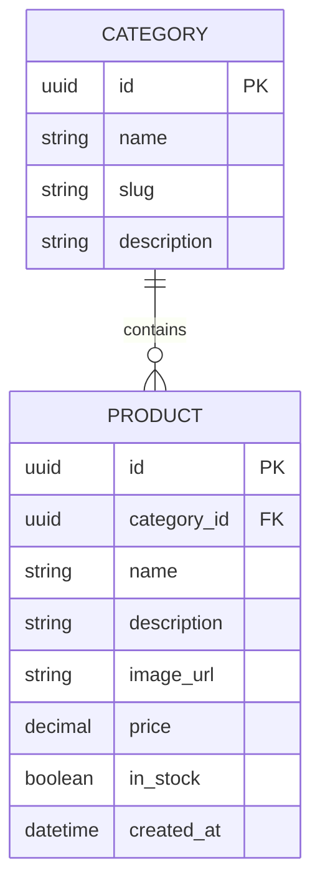

<div align="center">

# 🛍️ Bhawani Enterprises

**A live client-facing product catalogue with real-time Supabase backend**

[](https://react.dev)
[](https://supabase.com)
[](https://postgresql.org)
[](https://tailwindcss.com)
[](https://bhawanienterprise.co.in)

### 🌐 [bhawanienterprise.co.in](https://bhawanienterprise.co.in)

</div>

---

## 📖 About

Bhawani Enterprises is a real client project — a professional product catalogue website built and deployed for an actual business. Customers can browse the full product range with a clean, fast UI backed by Supabase's real-time PostgreSQL database.

Built entirely solo: from requirements gathering and UI design through to deployment. Every layer — database schema, row-level security, React components, and hosting — was owned end-to-end.

---

## ✨ Features

- 🗂️ **Product Catalogue** — Browse full product range with categories and details
- ⚡ **Real-time Data** — Supabase real-time sync keeps content always up to date
- 🔒 **Row-Level Security** — Supabase RLS ensures data is served safely
- 📱 **Fully Responsive** — Mobile-first design with Tailwind CSS
- 🚀 **Fast Load** — Optimised React build with minimal bundle size

---

## 🏗️ Architecture



---

## 🗄️ Database Schema



---

## ⚙️ Tech Stack

| Layer | Technology |
|-------|-----------|
| Frontend | React 18, JavaScript |
| Styling | Tailwind CSS |
| Backend | Supabase (PostgreSQL + Real-time) |
| Auth / Security | Supabase Row-Level Security |
| Media | Supabase Storage |
| Deployment | Live at bhawanienterprise.co.in |

---

## 🛠️ Local Setup

```bash
# 1. Clone the repo
git clone https://github.com/Tushal27/bhawani-enterprises.git
cd bhawani-enterprises

# 2. Install dependencies
npm install

# 3. Create .env file
cp .env.example .env
# Add your Supabase project URL and anon key

# 4. Start dev server
npm start
```

### Environment Variables
```env
REACT_APP_SUPABASE_URL=https://your-project.supabase.co
REACT_APP_SUPABASE_ANON_KEY=your_anon_key
```

---

## 📁 Project Structure

```
bhawani-enterprises/
├── src/
│   ├── components/     # Reusable UI — ProductCard, Navbar, Filter
│   ├── pages/          # Catalogue, Product Detail
│   ├── hooks/          # useProducts, useCategories
│   ├── lib/            # Supabase client config
│   └── index.js        # Entry point
├── public/
└── package.json
```

---

<div align="center">

Built with ❤️ by [Tushal J](https://github.com/Tushal27) · [🌐 Live Site](https://bhawanienterprise.co.in) · [LinkedIn](https://linkedin.com/in/tushal-j)

</div>
